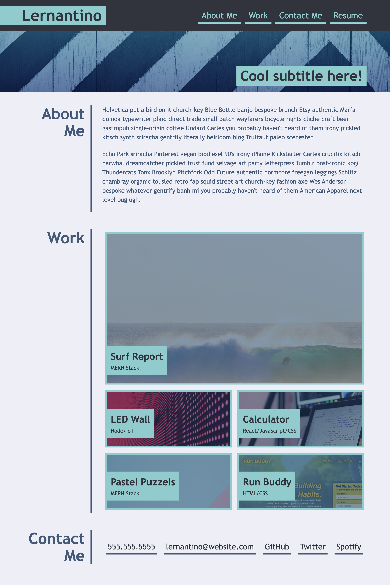

# Portfolio Assignment for Brandon Carter
    In this assignment, we were given the task of creating our own portfolio using our basic understanding of HTML (with semantic tags) and Advanced CSS. 
   
    We were provided the following gif as a template to base our portfolio:

# The portfolio contains the following info:
    1. A photo of ourselves
     
    2. Information about ourselves
    3. And our [Contact](https://brandnn07.github.io/portfolio-assignment-hw) info 